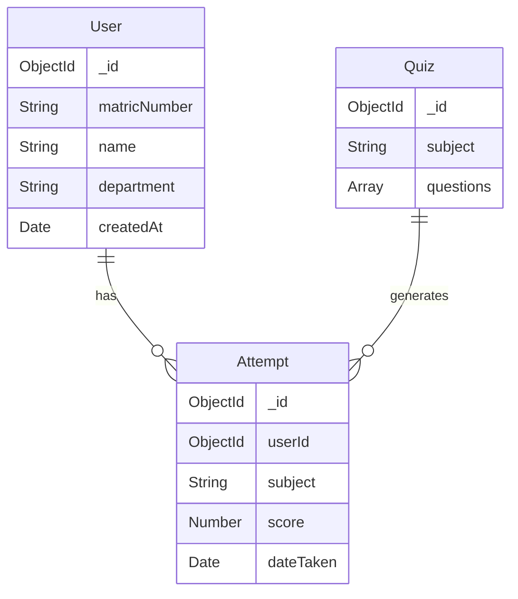

# Database Design Document
## Quizzax Assessment Platform

**Team Name:** Team Alpha  
**Phase:** 2.2  
**Date:** January 16, 2026

---

## 1. Entity-Relationship Diagram (ERD)

**Entities**:
1.  **User**: Represents the student.
2.  **Quiz**: Represents a subject/course containing questions.
3.  **Attempt**: Represents a single completed quiz session.

**Relationships**:
*   A **User** can have multiple **Attempts** (One-to-Many).
*   A **Quiz** is referenced by multiple **Attempts** (One-to-Many).



---

## 2. Database Schema

### 2.1 User Collection (`users`)
| Field | Type | Description | Constraints |
| :--- | :--- | :--- | :--- |
| `_id` | ObjectId | Unique identifier | Primary Key |
| `matricNumber` | String | Student ID | Unique, Required |
| `name` | String | Full Name | Required |
| `department` | String | Academic Dept | Required |
| `history` | Array | List of past attempts | Embedded Document |
| `activeSession` | Object | Current quiz state | Embedded Document |

### 2.2 Quiz Collection (`quizzes`)
| Field | Type | Description | Constraints |
| :--- | :--- | :--- | :--- |
| `_id` | ObjectId | Unique identifier | Primary Key |
| `subject` | String | Course Name | Unique, Required |
| `icon` | String | UI Icon Name | Optional |
| `color` | String | UI Theme Color | Optional |
| `questions` | Array | List of Question Objects | Embedded (See below) |

**Question Object Structure**:
```json
{
  "questionText": "String",
  "options": ["Array of 4 Strings"],
  "correctOption": "Number (0-3)",
  "explanation": "String"
}
```

---

## 3. Normalization Explanation

The database design adheres to **NoSQL best practices**, effectively reaching an equivalent of **Second Normal Form (2NF)** adapted for MongoDB's document model.

### First Normal Form (1NF)
*   **Compliance**: All fields contain atomic values (strings, numbers, dates).
*   **Adaptation**: We intentionally violate strict 1NF by using **Arrays** for `questions` and `history`. In MongoDB, embedding these related data points improves read performance by avoiding expensive `$lookup` (JOIN) operations.

### Second Normal Form (2NF)
*   **Compliance**: All non-key attributes are fully functional dependent on the primary key (`_id`).
*   **Why we stopped here**: We embedded `questions` directly into the `Quiz` document. While this technically duplicates data if a question were used in multiple quizzes, our requirements specify unique pools per subject. Embedding ensures that fetching a quiz retrieves all its questions in a **single database query**, optimizing for speed (< 200ms response requirement).

### Third Normal Form (3NF)
*   **Violation**: Storing `history` (attempts) inside the `User` document.
*   **Justification**: A normalized SQL approach would have a separate `Attempts` table. However, since a student's history is always displayed on their profile, embedding it avoids a secondary query. The document size limit (16MB) is sufficient for thousands of attempts per student.
