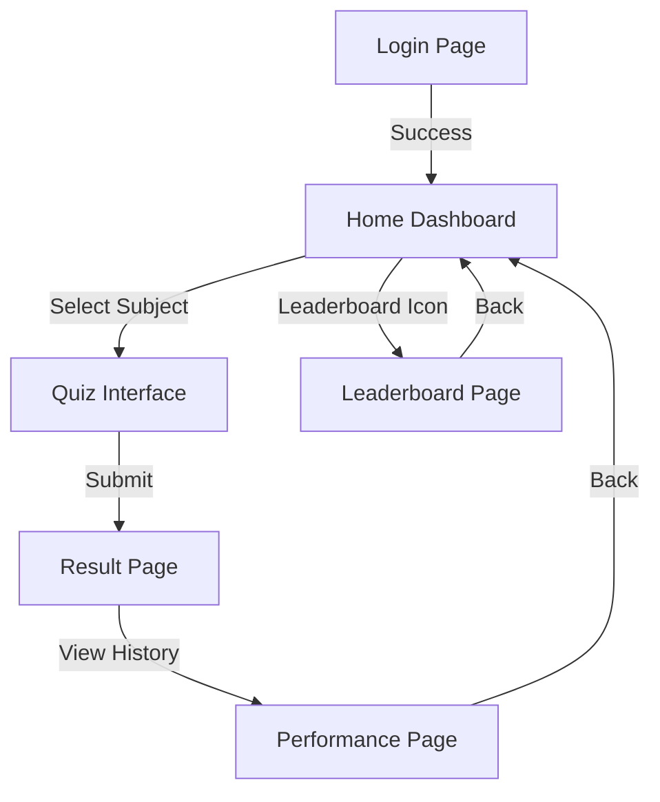

# User Interface Design Document
## Quizzax Assessment Platform

**Team Name:** Team Alpha  
**Phase:** 2.3  
**Date:** January 16, 2026

---

## 1. UI/UX Design Rationale

**Design Philosophy: "Glassmorphism"**
Quizzax utilizes a modern "Glassmorphism" aesthetic characterized by translucency, vivid background gradients, and floating elements.

*   **Rationale**: To create a sense of depth and hierarchy without clutter.
*   **Accessibility**: High-contrast white text on dark blurred backgrounds ensures readability in all lighting conditions.
*   **Feedback Loops**: Interactive elements (buttons, inputs) provide immediate visual feedback (hover states, focus rings) to guide the user.

---

## 2. Wireframe Descriptions (Main Screens)

### 2.1 Login Screen
*   **Layout**: Centered card on a dynamic gradient background.
*   **Elements**:
    *   Logo (Top Center)
    *   Input Field: "Enter Matric Number"
    *   Primary Button: "Sign In"
*   **Interaction**: Button is disabled until input validation passes.

### 2.2 Home Dashboard
*   **Layout**: Vertical list of actionable cards.
*   **Elements**:
    *   Header: "Welcome, [Name]"
    *   Search Bar: Filter by subject.
    *   Subject Cards: Engineering Math, Physics, etc., with icons.
    *   Bottom Navigation Bar.

### 2.3 Quiz Interface
*   **Layout**: Focused single-column view.
*   **Elements**:
    *   Top Bar: Countdown Timer (Left), Flag Button (Right).
    *   Question Area: Large, legible text.
    *   Option Stack: 4 vertical buttons (A-D).
    *   Footer Controls: "Prev", "Next" buttons.

### 2.4 Navigation Flow Diagram

---

## 3. Accessibility Considerations
1.  **Color Contrast**: All text elements meet a contrast ratio of at least 4.5:1 against their backgrounds.
2.  **Touch Targets**: Buttons have a minimum height of 44px to accommodate touch on mobile devices.
3.  **Keyboard Navigation**: All interactive elements are focusable via `Tab` key (outline styles preserved).
4.  **No Flashing Content**: Transitions are smooth (>300ms) to prevent seizures.

---

## 4. Tools Used
*   **Design**: Figma (Wireframing), CSS3 (Implementation).
*   **Diagrams**: Mermaid.js (Flowcharts).
